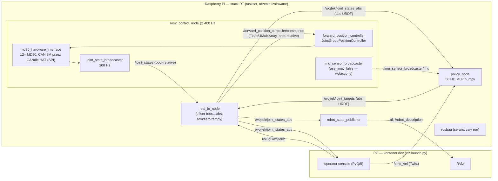
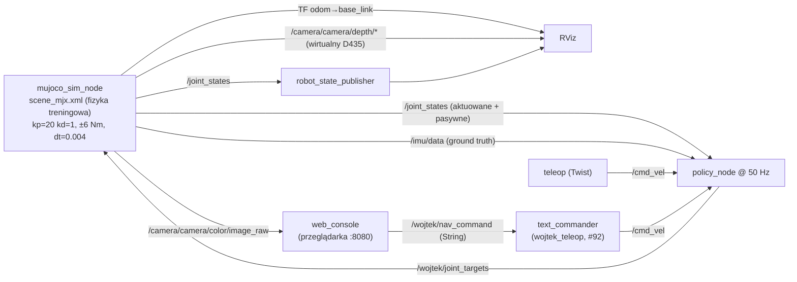

# Architektura ROS stacka (`ros/src`)

Stan na 2026-07-31 (branch `jakuc/CANdle_hat+BMI_9DOF` + #91 kamera, #92 text_commander).

Stack dzieli się na trzy warstwy:

* **warstwa sprzętowa** — pluginy ros2_control (C++), działają na RPi wewnątrz `ros2_control_node`,
* **warstwa sterowania** — Python: polityka RL + adapter I/O (RPi),
* **warstwa PC** — symulacja MuJoCo, RViz/PlotJuggler, konsola operatora.

Wspólnym językiem między nodami są **absolutne kąty URDF** na topicach `wojtek/*`.

## Przepływ danych — realny robot

## Przepływ danych — symulacja (`sim.launch.py`)

**Od 2026-08-06 symulacja to ten sam graf co robot z podmienionym pluginem
sprzętowym.** `sim.launch.py` i `robot.launch.py` wołają to samo
`wojtek_bringup.launch_common`, więc controller_manager (400 Hz), broadcastery,
`forward_position_controller`, `real_io_node` i **wszystkie parametry
`policy_node`** są identyczne — nie „podobne". Test
`wojtek_pc/test/test_sim_launch.py` pilnuje tej równości, a
`test_sim_xacro.py` zgodności interfejsów obu URDF-ów. Skutek: `zero`,
`stand_up`/`lie_down`, arm gate, guard `max_arm_jump_rad` i watchdog są w
symulacji **wykonywane**, a nie omijane.

`hw:=` wybiera plant:

| `hw` | Plant | Do czego |
|---|---|---|
| `mock` | `mock_components/GenericSystem` — komenda wraca jako stan, zero dynamiki | logika stacku (arm/zero/rampy/watchdog), CI; robot nie upadnie i nie pójdzie |
| `mujoco` | fizyka z `scene_mjx.xml` (`wojtek_mujoco_hardware_interface`) | zachowanie robota: chód, upadki, `boot_pose:=folded`, wirtualna kamera |

**Plugin MuJoCo** (`wojtek_mujoco_hardware_interface`, C++) wchodzi w to samo
gniazdo pluginlib co `md80_hardware_interface` + `imu_i2c_hardware_interface` i
eksportuje te same interfejsy. Trzy rzeczy w nim nie są „tylko symulacją":

- **stany boot-relative**: `on_activate` zapamiętuje bieżącą pozę jako zero, a
  komendy są czytane w tej samej ramce — dokładnie semantyka MD80, dzięki
  której `/wojtek/zero` i offsety są testowane, nie omijane. Poza startową
  bierze z `boot_pose`, tego samego argumentu co `real_io_node`;
- **akumulacja czasu**: fizyka idzie o okres kontrolera z przeniesieniem
  reszty (dt=4 ms pod pętlą 2,5 ms), a nie o całe kroki — inaczej dostajemy
  jitter, którego robot nie ma;
- **montaż IMU**: odczyty są obracane do ramki fizycznego czujnika
  (`imu_mount_rpy`, domyślnie 0,π,0), więc `policy_node` odkręca realny montaż,
  a nie zero. Magnetometr jest syntetyzowany (pole ziemskie); hard-iron
  świadomie nie — to osobna robota.

Ground truth (którego robot nie ma) publikuje sam plugin, 100 Hz:
`TF odom→base_link`, `/odom_vel`, `/sim/rtf`, `/sim/qpos`. **Kamera** to osobny
node `sim_camera_node`: fizyka żyje w `ros2_control_node` (C++), renderer jest
w Pythonie, więc nie dzielą `MjData` — node lustruje `/sim/qpos` we własnej
kopii modelu i renderuje z niej (kontrakt tematów: `wojtek_pc/camera_spec.py`).

Czego symulacja nie pokryje — patrz [kontrakt testowy](sim-test-contract.md).

Poniższy schemat opisuje **starą** ścieżkę `mujoco_sim_node` (node dalej
istnieje i da się go odpalić przez `ros2 run wojtek_pc mujoco_sim_node`, ale
nie jest już tym, co stawia `sim.launch.py`; idzie do usunięcia razem z
sesją sprzątania). `mujoco_sim_node` zastępował cały lewy słupek (hardware +
broadcastery + real_io_node); `policy_node` był identyczny co do kodu, ale
dostawał inne parametry.

---

## 1. `wojtek_policy` — mózg (Python, ament_python)

Runtime wytrenowanej polityki RL + node ROS. Działa na RPi i w symulacji.

**Pliki:**

* `wojtek_policy/policy.py` — `WojtekPolicy`: czysty numpy runtime (bez importów ROS, testowalny unit-testami). Ładuje `policy.npz` (wagi MLP z SiLU + tanh) i `policy_meta.json`; składa wektor obserwacji wg `obs_layout` z meta (dzięki temu jeden runtime obsługuje rodziny polityk z IMU i bez — "springy" jest proprioceptywna), liczy `targets = clip(anchor + tanh_mlp(obs)·action_scale, target_low, target_high)`. Ma clampy bezpieczeństwa na kolano (singularność czworoboku — snap-through może złamać mechanizm) i abdukcję.
* `wojtek_policy/policy_node.py` — node ROS (opis niżej).
* `wojtek_policy/joint_map.py` — `JointMap`: afiniczne mapowanie konwencji MuJoCo↔URDF (`q_urdf = sign·q_mjc + offset`), wczytywane z `config/joint_map.yaml`.
* `wojtek_policy/poses.py` — nazwane pozy współdzielone przez real i sim: `FOLDED_KNEE_RAD = 0.425` (poza boot/zerowania), `folded_ctrl()`, oraz `PASSIVE_FROM_KNEE` — wielomiany 8. stopnia dające kąty pasywnych przegubów czworoboku (fourth/fifth) z kąta kolana (dopasowane do domknięcia MJCF, błąd ≤ 7e-5 rad).
* `config/` — `joint_map.yaml`; `test/test_policy.py`. Wagi polityki nie są wendorowane: `policy_node` ładuje je po referencji (`policy:=`).

**Node: `policy_node`** (nazwa: `wojtek_policy`) — pętla 50 Hz (z `ctrl_dt` w meta): sensory → cele pozycyjne stawów.

| Kierunek | Interfejs | Typ |
|---|---|---|
| sub | `/joint_states` (absolutne URDF) | `sensor_msgs/JointState` |
| sub | `/imu/data` | `sensor_msgs/Imu` |
| sub | `/cmd_vel` (przycinany do boxa komend z treningu; `linear.z > 0` = komenda wysokości stania dla polityk z komendą 4-D) | `geometry_msgs/Twist` |
| pub | `/wojtek/joint_targets` (absolutne URDF, 12 stawów) | `sensor_msgs/JointState` |
| srv | `/wojtek/enable` | `std_srvs/SetBool` |
| srv | `/wojtek/reset` | `std_srvs/Trigger` |

Parametry: `policy_dir`, `joint_map_yaml`, `imu_mount_rpy` (rotacja IMU→base_link; real: `[0, π, 0]`, sim: zera), `clamp_knee`, `auto_enable`, `soft_start_s` (blend od pozy mierzonej do wyjścia polityki), `watchdog_timeout_s` (0.2 s — przy nieświeżych danych **wstrzymuje publikację**; MD80 trzyma ostatni cel), `gravity_from_accel` (filtr komplementarny zamiast kwaternionu IMU, dla IMU bez fuzji).

Zabezpieczenia: watchdog świeżości per-sensor (polityka bez IMU przeżywa dropout IMU), odrzucanie NaN w wejściach (NaN zatruwałby stan przez pętlę `last_action`), reset stanu polityki na krawędzi hold→run.

## 2. `wojtek_bringup` — strona robota (Python, ament_python)

Bring-up realnego robota: ros2_control + adapter + procedura operacyjna.

**Pliki:**

* `launch/robot.launch.py` — **kanoniczny launch na RPi** (bez GUI). Startuje: `ros2_control_node` (URDF z `wojtek_real.urdf.xacro` + `config/real_controllers.yaml`), spawnery kontrolerów, `robot_state_publisher` (remap na `/wojtek/joint_states_abs` — RViz dostaje kąty absolutne), statyczny TF `odom→base_link` (brak odometrii na realu), `real_io_node`, `policy_node` (z remapami `joint_states→wojtek/joint_states_abs`, `imu/data→imu_sensor_broadcaster/imu`), opcjonalnie rosbag.
  Argumenty: `max_torque` (dom. 6.0 — tyle co w treningu), `bus` (dom. `spi` = CANdle HAT), `can_baud` (dom. `8` — napędy przeflashowane na 8M od 2026-07-17), `use_imu` (dom. `false` — szeregowy IMU wycofany na rzecz I2C Adafruit 5543, jeszcze nie zintegrowanego), `imu_port`, `dry_run`, `boot_pose` (`home`/`folded`), `bag`, `bag_dir`, `bag_cpus` (affinity nagrywarki poza rdzeniami RT).
* `launch/real.launch.py` — starsza wersja tego samego (z ery IMU BMI160 po USB); `robot.launch.py` go zastąpił.
* `config/real_controllers.yaml` — controller_manager @ **400 Hz**; `joint_state_broadcaster` (200 Hz), `imu_sensor_broadcaster` (100 Hz, sensor `imu`, frame `imu_link`), `forward_position_controller` (`JointGroupPositionController`) z listą 12 stawów **w kolejności aktuatorów polityki** (rear_left, rear_right, front_right, front_left × first/second/third).
* `urdf/wojtek_real.urdf.xacro` — składa opis robota z `wojtek_description` + ros2_control; `urdf/wojtek_ros2_control.urdf.xacro` — makra: `wojtek_ros2_control` (12 stawów MD80, per staw: `can_id` (10-12/20-22/30-32/40-42), `max_torque`, gainy impedancji `ddq_kp=20, ddq_kd=1` — dokładnie model aktuatora z treningu) oraz makra IMU (BMX160/BMI160 — obecnie nieużywane).
* `wojtek_bringup/robot.py` — **CLI `ros2 run wojtek_bringup robot`**: jednokomendowy bring-up z kontenera na PC. Odpala stack na RPi przez SSH (domyślnie: systemd `wojtek-robot.service` z RT-pinningiem na izolowane rdzenie; `--dry-run` = launch bez RT; `--sim` = MuJoCo lokalnie), plus lokalnie viz i konsolę operatora; Ctrl-C składa wszystko. Wstrzykuje `ROS_DOMAIN_ID=42` + CycloneDDS do zdalnej sesji (bez tego RPi ląduje na domenie 0 i PC nie widzi topiców).

**Node: `real_io_node`** (nazwa: `wojtek_real_io`) — adapter między polityką a ros2_control. Powód istnienia: MD80 raportuje pozycje **względem pozy aktywacji**, a polityka pracuje w **absolutnych kątach URDF** — node przesuwa o offset w obie strony i jest bramką bezpieczeństwa.

| Kierunek | Interfejs | Typ |
|---|---|---|
| sub | `/joint_states` (boot-relative) | `sensor_msgs/JointState` |
| sub | `/wojtek/joint_targets` (absolutne) | `sensor_msgs/JointState` |
| pub | `/wojtek/joint_states_abs` (12 stawów + osobna wiadomość z pasywnymi przegubami czworoboku z `PASSIVE_FROM_KNEE` — bez tego RViz rysuje "połamane" nogi) | `sensor_msgs/JointState` |
| pub | `/forward_position_controller/commands` (boot-relative) | `std_msgs/Float64MultiArray` |
| srv | `/wojtek/arm` — dopiero to przepuszcza komendy do silników | `std_srvs/SetBool` |
| srv | `/wojtek/stand_up`, `/wojtek/lie_down` — wolne rampy cosinusowe do pozy home/folded | `std_srvs/Trigger` |
| srv | `/wojtek/zero` — "robot jest TERAZ fizycznie w pozie boot", przelicza offset | `std_srvs/Trigger` |

Parametry: `policy_dir`, `joint_map_yaml`, `max_arm_jump_rad` (0.15 — odmowa ARM, gdy robot daleko od home), `dry_run` (loguje komendy zamiast publikować), `boot_pose`, `folded_knee_rad`, `ramp_duration_s` (4.0), `ramp_rate_hz` (50).

Zabezpieczenia: startuje DISARMED; arm/rampa/zero wzajemnie się wykluczają; filtr non-finite tuż przed napędami (ostatnia linia obrony — topic komend jest otwarty dla każdego).

## 3. `wojtek_pc` — narzędzia PC (Python, ament_python)

Symulacja, wizualizacja i ręczne sterowanie. Nie jedzie na RPi (`deploy.sh`
wyklucza `wojtek_pc/` z rsynca). Do 2026-08-06 paczka nazywała się
`wojtek_viz`; przemianowana, bo nosi symulator, nie tylko podglądanie.
Workspace zbudowany przed zmianą trzyma starą paczkę w overlayu i przesłania
nową — `rm -rf build/wojtek_viz install/wojtek_viz` raz, przed rebuildem.

`sim.launch.py` **nie ma własnych parametrów sterowania** — deleguje do
`wojtek_bringup.launch_common` (patrz sekcja o przepływie danych w symulacji)
i dokłada tylko rzeczy PC-owe: RViz z `config/sim.rviz`, `text_commander` i
wirtualną kamerę.

**Pliki:** `launch/sim.launch.py`, `launch/viz.launch.py`, `config/{scene_mjx,wojtek_mjx}.xml` (kopie modeli MJX), `config/perception.rviz` (widok głębi/chmury, port z gałęzi percepcji), `urdf/wojtek_sim.urdf.xacro`, `wojtek_pc/camera_spec.py` (kontrakt kamery D435: intrinsics/mount/frame'y/tematy), `wojtek_pc/depth_camera.py` (offscreen renderer + wstrzykiwanie kamery przez MjSpec).

**Node: `mujoco_sim_node`** (nazwa: `wojtek_mujoco_sim`) — symulator real-time zamykający pętlę z policy_node na dokładnie tej fizyce, na której trenowano (`scene_mjx.xml`: serwa kp=20/kd=1, forcerange ±6, dt=0.004), krokowany do zegara ściennego (z limitem kroków — brak spirali śmierci przy lagu).

| Kierunek | Interfejs | Typ |
|---|---|---|
| sub | `/wojtek/joint_targets` | `sensor_msgs/JointState` |
| pub | `/joint_states` (aktuowane + pasywne, z efforts) | `sensor_msgs/JointState` |
| pub | `/imu/data` (ground truth z sensorów MuJoCo, frame base_link) | `sensor_msgs/Imu` |
| pub | TF `odom→base_link` (ground-truth poza bazy) | tf2 |
| pub | `/odom_vel` (debug) | `geometry_msgs/Twist` |
| pub | `/sim/rtf` (real-time factor, okna 1 s — pomiar, nie opinia) | `std_msgs/Float32` |
| pub | `/camera/camera/depth/image_rect_raw` (16UC1, mm, 424x240, ~15 Hz) | `sensor_msgs/Image` |
| pub | `/camera/camera/depth/camera_info` (intrinsics zgodne z renderem) | `sensor_msgs/CameraInfo` |
| pub | `/camera/camera/color/image_raw` (rgb8, ~5 Hz, dla VLM) | `sensor_msgs/Image` |
| pub | `/camera/camera/color/camera_info` | `sensor_msgs/CameraInfo` |
| srv | `/sim/reset` | `std_srvs/Trigger` |

Wirtualna kamera D435 (#91): tematy, kodowanie i frame'y identyczne z realnym stosem `wojtek_perception_bringup`, więc konsumenci głębi/VLM działają w symulacji bez zmian (redukcja do siatki 8x8 usunięta 2026-08 razem ze ścieżką SCAN-plannera). Render offscreen (MuJoCo `Renderer`, EGL) na osobnym wątku z prywatną `MjData` — fizyka nie zwalnia; stemple obrazów = stemple TF `odom→base_link` z tego samego ticku fizyki. Kamera jest wstrzykiwana do modelu przy starcie przez `MjSpec` (pozycja/FOV z `wojtek_pc/camera_spec.py`, jedno źródło prawdy dla MJCF, URDF i CameraInfo; patrz #93 dla docelowego przeniesienia do `build_model.py`). TF `base_link→camera_link→camera_depth_optical_frame` daje URDF (`with_camera` w `body.urdf.xacro`), nie plik konfiguracyjny. Bez działającego backendu GL kamera degraduje się do off z warningiem — fizyka działa dalej. QoS: sensor data (best effort). Głębia: 0 = brak zwrotu (jak RealSense), okno 0.3–3.0 m.

Parametry: `model_xml` (puste = przygotuj MJX z share z przepisaniem meshdir), `joint_map_yaml`, `publish_rate_hz` (100), `realtime_factor`, `initial_pose` (`home`/`folded` — folded uzyskiwane przez fizyczne "osiadanie" z home, żeby domknięcie czworoboku było spójne), `folded_knee_rad`, `camera` (true; wyłącznik dla słabszych maszyn), `camera_depth_hz` (15), `camera_color_hz` (5), `depth_min_m`/`depth_max_m` (0.3/3.0).

**Node: `console`** (`operator_console.py`, nazwa: `operator_console`) — GUI PyQt5, jedno okno na wszystkie ręczne operacje (zamiast `ros2 service call`). Cztery moduły:

* **M1** — przyciski serwisów `/wojtek/{arm,zero,stand_up,lie_down,enable,reset}`,
* **M2** — telemetria na żywo z `/wojtek/joint_states_abs` i `/imu/data`,
* **M3** — jog per-staw: slidery publikują `/wojtek/joint_targets` z własną rampą 0.8 rad/s (wymaga: armed + policy DISABLED),
* **M4** — pad XY (vx, yaw) + slider strafe + slider wysokości → `/cmd_vel` @ 20 Hz (wysokość na `linear.z`), puszczenie pada/strafe = stop, wysokość trzyma nastawę (wymaga: armed + policy ENABLED).

Nie ma topicu statusu arm/enable — konsola śledzi stan lokalnie z odpowiedzi serwisów. rclpy spinuje w wątku tła, do GUI przez sygnały Qt.

**Node: `web_console`** (`web_console.py`) — przeglądarkowy bliźniak konsoli Qt (jeden port 8080: strona + websocket JSON), działa bez X11 (macOS, telefony na AP robota). Te same moduły co Qt plus **panel VLM** (#92): podgląd kamery kolorowej i komendy tekstowe — przeglądarka to "fotel VLM-a", człowiek widzi dokładnie to, co przyszły VLM (obraz z `/camera/.../image_raw`) i steruje wyłącznie przez jego kontrakt (`/wojtek/nav_command` → `text_commander` → `/cmd_vel`), nigdy przez `/cmd_vel` bezpośrednio. Klatki JPEG (Pillow, jakość 80) idą binarnymi ramkami websocketu obok nietkniętego protokołu JSON; subskrypcja kamery ma QoS sensor-data (best-effort — domyślny QoS nie odebrałby nic). Bez Pillow lub bez kamery panel po prostu nie pokazuje klatek, reszta konsoli działa.

| Kierunek | Interfejs | Typ |
|---|---|---|
| sub | `/camera/camera/color/image_raw` (rgb8 → JPEG do przeglądarek) | `sensor_msgs/Image` |
| pub | `/wojtek/nav_command` (panel VLM; wymaga `text_commander` — w symulacji startuje automatycznie z `sim.launch.py`) | `std_msgs/String` |
| pub | `/cmd_vel`, `/wojtek/joint_targets` + serwisy — jak konsola Qt | — |

**Launche:**

* `sim.launch.py` — robot_state_publisher + mujoco_sim_node + policy_node (imu_mount_rpy=0, soft_start 0.5 s, bez clamp_knee) + text_commander (#92; rezydentny — milczy dopóki nie dostanie komendy) + RViz. Argumenty: `rviz`, `initial_pose`, `camera` (true), `camera_depth_hz`, `camera_color_hz`. Argumenty `name:=value` przechodzą z `./sim.sh` przez `robot.py` (np. `./sim.sh camera:=false`).
* `viz.launch.py` — czyste PC-side dla żywego robota: RViz (czyta `/robot_description` i `/tf` z RPi po DDS), opcjonalnie PlotJuggler, oraz rosbag całego runu **na żądanie** (`bag:=true`, do `~/wojtek_bags/run_<timestamp>`; domyślnie wyłączony). Zero hardware'u, zero RSP.

## 4. `md80_hardware_interface` — napędy (C++, plugin ros2_control)

**Nie jest nodem** — to plugin `SystemInterface` ładowany przez `ros2_control_node` (`md80_hardware_interface/MD80HardwareInterface`). Gada z 12 napędami MD80 (AK80-9) przez CANdle.

* Parametry hardware (z URDF): `bus` (`spi`|`usb`; SPI = CANdle HAT, domyślne urządzenie `/dev/spidev0.0`), `can_baud` (1|2|5|8 Mbps — **musi** zgadzać się z flashem napędów; teraz 8M), `usb_port`, `spi_device`. Per staw: `can_id`, `max_torque`, gainy impedancji `ddq_kp`/`ddq_kd` (parametry `q_*`/`dq_*` wymagane przez parser, nieużywane w IMPEDANCE).
* Eksportuje: stany position/velocity/effort, komendę position (→ tryb IMPEDANCE: `tau = kp·(q_t − q) − kd·dq`, clamp do `max_torque`; velocity→VELOCITY_PID, effort→RAW_TORQUE też wspierane).
* Ważne poprawki forka: retry `addMd80()` ×3 (na USB ~5% transakcji flakowało i co drugi launch padał) oraz przesunięcie komend w `write()` o offset aktywacji, żeby read i write były w jednej ramce (bez tego `/wojtek/zero` nie byłby dokładny).
* `scripts/flash_motors.py` — jednorazowe `mdtool setup` konfiguracji AK80-9 na wszystkie 12 ID.

## 5. `bmi160_serial_hardware_interface` / `bmx160_serial_hardware_interface` — IMU (C++, pluginy ros2_control)

Dwa bliźniacze pluginy `SensorInterface` czytające IMU przez mostek serial (MCU z firmware Mahony w `firmware/`): BMX160 = pełny 9-DoF z magnetometrem, BMI160 = "loaner" bez magnetometru. Parametry: `port`, `baud_rate` (115200; naprawiony bug `cfsetospeed`). Eksportują `orientation.*`, `angular_velocity.*`, `linear_acceleration.*` (BMX też `magnetometer.*`); odczyt z deadline'em — brak danych degraduje do stale zamiast NaN.

**Status: de facto martwe** — sprzęt odłączony (`use_imu:=false` domyślnie), zastępuje je IMU I2C (Adafruit 5543: LSM6DS3TR-C + LIS3MDL), którego bench-testy w `ros/hw_tests/imu_i2c` przeszły, ale paczka ROS jeszcze nie istnieje (w backlogu: nowa paczka + skasowanie obu serialowych).

## 6. `wojtek_description` — model robota (CMake, tylko dane)

Bez nodów. Źródło prawdy o geometrii:

* `urdf/` — modularne xacro: `body`, `leg`, `inertia`, `wojtek.urdf.xacro` — z pasywnymi przegubami fourth/fifth **bez** domknięcia czworoboku (URDF go nie umie),
* `mujoco/` — `wojtek.xml`, `wojtek_mjx.xml` + sceny; tu domknięcie istnieje jako equality connect; wersje MJX to te treningowe,
* meshe oraz historyczne launche (`bringup`, `simulation` — Gazebo, nieużywane w obecnym flow).

## 7. `wojtek_teleop` — teleop po stronie robota (Python, ament_python)

Wejścia sterujące bez GUI (buduje się na RPi): pad Xbox za standardowym
driverem `joy` oraz — od #92 — komendy tekstowe. Oba mówią tym samym
`/cmd_vel` co konsole, więc nic w `wojtek_bringup`/`wojtek_policy` się nie
zmienia.

**Node: `gamepad_teleop`** — lewy drążek vx/yaw, prawy strafe, A = arm,
Y/B = stand_up/lie_down, D-pad = wysokość; skalowanie do boxa komend z
kontraktu polityki, dead-man `cmd_timeout_s` (0.5 s) po zaniku `joy`.

**Node: `text_commander`** (#92) — zamraża ROS-owy kontrakt przyszłego
VLM-a: VLM konsumuje `/camera/camera/color/image_raw`, publikuje
`/wojtek/nav_command` — nic więcej. Komendy `forward`/`left`/`right`/`stop`;
nieznana komenda = warning + stop. Publikuje @ 20 Hz tylko gdy komenda jest
aktywna; po `stop` lub po `command_timeout` (2.0 s) wysyła **dokładnie
jeden** zerowy Twist i milknie — zero jest obowiązkowe (policy_node
zatrzaskuje ostatnią komendę), a cisza pozwala innemu źródłu (konsola, pad)
przejąć `/cmd_vel` bez przekrzykiwania. `linear.z` zostaje 0.0 ("domyślna
wysokość" dla policy_node). Czysta logika (`CommandState`) jest oddzielona
od powłoki rclpy i testowana bez ROS-a (`test/test_text_commander.py`).

| Kierunek | Interfejs | Typ |
|---|---|---|
| sub | `/wojtek/nav_command` (`forward`/`left`/`right`/`stop`) | `std_msgs/String` |
| pub | `/cmd_vel` (@ 20 Hz gdy aktywna komenda; jeden zerowy Twist na stop/timeout) | `geometry_msgs/Twist` |

Parametry: `v_forward` (0.3 m/s), `w_turn` (0.5 rad/s), `command_timeout`
(2.0 s — dead-man: VLM musi mówić, żeby Wojtek szedł). Test z CLI:
`ros2 topic pub -1 /wojtek/nav_command std_msgs/String "data: forward"`.

---

## Rzeczy nieoczywiste, które warto wiedzieć

1. **Trzy układy współrzędnych stawów**: MuJoCo/policy (kolejność aktuatorów, konwencja treningu) ↔ URDF absolutne (wspólny język topiców `wojtek/*`) ↔ boot-relative (to, co widzi/przyjmuje MD80). Konwersje: `JointMap` (policy_node, sim) i `_offset_urdf` (real_io_node).
2. **Podwójna bramka bezpieczeństwa**: `/wojtek/enable` (czy polityka liczy) jest niezależne od `/wojtek/arm` (czy komendy idą do silników). Na realu `auto_enable:=true`, bo bramką jest arm.
3. **Kolejność stawów w `forward_position_controller` musi się zgadzać** z `policy_meta.json` — real_io_node publikuje goły `Float64MultiArray` bez nazw.
4. **RViz na realu** karmiony jest z `/wojtek/joint_states_abs` (remap RSP), nie z surowego `/joint_states` — i to real_io_node dolicza pasywne przeguby czworoboku.
5. **Bagi**: realne jazdy nagrywa robot — serwis przekazuje `bag:=true bag_cpus:=0,1` (bezstratnie, localhost); PC nagrywa na żądanie (`viz.launch.py bag:=true` po DDS, `real.launch.py` domyślnie). Rotacji na razie brak — przed długą jazdą sprawdź wolne miejsce na karcie RPi.
